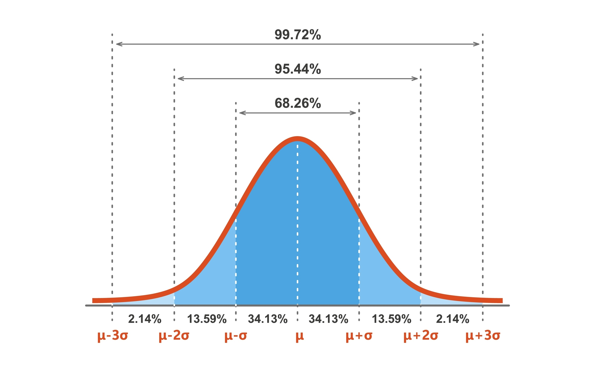

To explain these concepts, let's use the example of human height. Imagine the average height of a population is 170 cm with a standard deviation of 10 cm.

### 1. Normal Distribution

A **normal distribution** (or Gaussian distribution) is a symmetric, bell-shaped curve where most data points cluster around the mean. In our height example, most people are close to 170 cm, while very tall or very short people are rare.


### 2. Z-Score

A **Z-score** tells you exactly how many standard deviations a specific value is from the mean. It "standardises" data so you can compare different datasets.

*   **Formula:** $Z = \frac{\text{observed value} - \text{mean}}{\text{standard deviation}}$
*   **Example:** A person who is 190 cm tall has a Z-score of +2.0, meaning they are 2 standard deviations taller than average.

### 3. Hypothesis Testing

This is a formal way to test a claim using data.

*   **Null Hypothesis ($H_0$):** The "default" assumption (e.g., "This group of athletes has the same average height as the general population").
*   **Alternative Hypothesis ($H_1$):** What you want to prove (e.g., "The athletes are significantly taller").
*   **P-value:** The probability that your results happened by random chance. If the P-value is < 0.05, we usually "reject the null hypothesis" and conclude the difference is real.

```pyhton
import numpy as np
from scipy import stats

# Population Parameters
pop_mean = 170
pop_std = 10

# 1. Calculate Z-Score for a 190cm person
individual_height = 190
z_score = (individual_height - pop_mean) / pop_std
print(f"Z-Score: {z_score}") 
# Result: 2.0 (They are 2 standard deviations above the mean)

# 2. Hypothesis Testing
# Suppose we measure 30 basketball players with an average height of 185cm
np.random.seed(42)
players = np.random.normal(185, 10, 30)

# One-sample t-test: Comparing sample mean to population mean (170)
t_stat, p_value = stats.ttest_1samp(players, pop_mean)

print(f"P-value: {p_value:.10f}")
if p_value < 0.05:
    print("Result: Significantly taller (Reject Null Hypothesis)")
else:
    print("Result: No significant difference")

```


