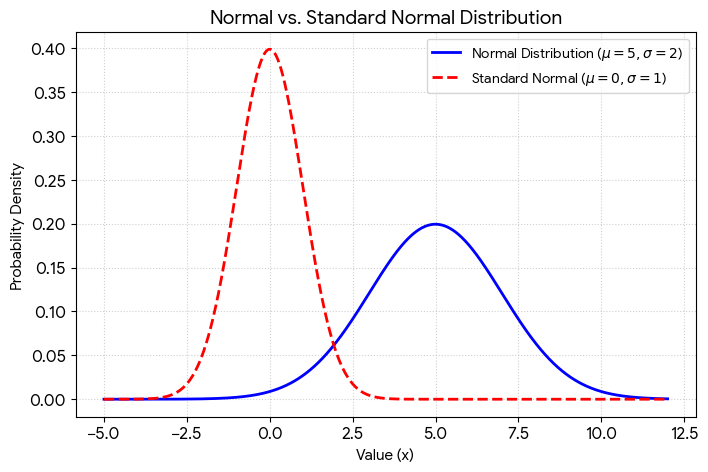

# Week-04-Day-20-PM

### Part A — Concept Application (40%)

#### 1. Dataset Generation and Basic Stats:
*   **Generate a dataset** (size = 1000) from a normal distribution.
*   **Compute mean, variance, and standard deviation** manually.
*   **Plot histogram** and verify if it resembles a normal distribution.  
[Solution](noraml_dstrbnt.py)

#### 2. Standard Normal Distribution (Z-score):
*   **Convert the dataset** into a standard normal distribution (Z-score).
*   **Implement Z-score calculation** manually.
*   **Verify** mean ≈ 0 and standard deviation ≈ 1.  
[Solution](noraml_dstrbnt.py)

#### 3. Student Marks Analysis:
*   **Compute** mean, median, variance, and standard deviation.
*   **Identify outliers** using Z-score ($|Z| > 2$ or $3$).  
[Solution](outlier_student_marks.py)

#### 4. One-Sample Hypothesis Test:
*   **Null hypothesis**: $\mu$ = given value.
*   **Compute Z-statistic** manually.
*   **Conclude** whether to reject $H_0$ at $\alpha = 0.05$.  

Explanation
*   **Null Hypothesis ($H_0$):** $\mu = 50$
*   **Manual Z-statistic:** $Z = \frac{\bar{x} - \mu}{\sigma/\sqrt{n}}$
*   **Decision:** If $|Z| > 1.96$ (for $\alpha = 0.05$), reject $H_0$.

#### 5. Simulation:
*   **Simulate multiple samples** (at least 1000 times).
*   **Perform hypothesis test** each time under $H_0$ true.
*   **Estimate the false positive rate** and compare with significance level ($\alpha$).  
[Solution](fale_pst_from_sngfnct_lvl.py)

---

### Part B — Stretch Problem (30%)

#### 1. Distribution Comparison:
*   **Compare Normal Distribution vs Standard Normal Distribution**: Generate both, plot, and explain differences.  
### Distribution Comparison

The **Standard Normal Distribution** is a specific type of **Normal Distribution** where the mean ($\mu$) is 0 and the standard deviation ($\sigma$) is 1. While there are infinitely many normal distributions based on different values for $\mu$ and $\sigma$, there is only **one** standard normal distribution.

### Visualization

The plot below compares a general Normal Distribution ($\mu = 5, \sigma = 2$) with the Standard Normal Distribution ($\mu = 0, \sigma = 1$).

### Key Differences

*   **Parameters:** A general normal distribution can have any real number for its mean and any positive number for its standard deviation. The standard normal distribution always has **$\mu = 0$** and **$\sigma = 1$**.
*   **Standardization:** You can convert any normal distribution into a standard normal distribution by calculating Z-scores using the formula:
    $$Z = \frac{x - \mu}{\sigma}$$
    This process allows for the comparison of data sets measured in different units.
*   **Shape & Position:** The mean ($\mu$) shifts the center of the curve left or right, while the standard deviation ($\sigma$) determines how "spread out" or "stretched" the bell shape is. A smaller $\sigma$ results in a narrower, taller peak, while a larger $\sigma$ creates a wider, flatter curve.
*   **Practical Use:** Historically, the standard normal distribution was essential because it allowed statisticians to use a single **Z-table** to find probabilities without performing complex integration for every unique distribution.

#### 2. Two-Group Testing:
*   **Perform hypothesis testing** on two groups.
*   **Compute difference in means** and interpret results (basic comparison).  

Use a **Two-Sample Z-test** to compare means.

$$Z = \frac{\bar{x}_1 - \bar{x}_2}{\sqrt{\frac{\sigma_1^2}{n_1} + \frac{\sigma_2^2}{n_2}}}$$  
[Code](hypothesis_testing.py)
### Interpretation of Results
* **Mean Difference:** Shows the raw distance between the averages of the two groups.
* **Z-Statistic:** Represents how many standard deviations the observed difference is away from zero (the null hypothesis).
* **Decision Rule:** If the Z-statistic > 1.96, we conclude the difference is likely not due to random chance, meaning one group performs significantly differently than the other.

#### 3. Conceptual Explanation:
*   When should you **standardize data**?
*   Why is **Z-score** important in machine learning?  
### Conceptual Explanation

* Standardize data when features have different units (e.g., comparing "Age" in years to "Income" in lakhs) to ensure fair weighting in algorithms. Specifically, it is essential when:
* Distance-based algorithms are used (e.g., K-Nearest Neighbors, SVM, K-Means clustering), as they otherwise treat larger numbers as more "important."
* Gradient Descent is the optimizer (e.g., Linear Regression, Neural Networks) to ensure faster and smoother convergence.
* Principal Component Analysis (PCA) is performed, as it relies on variance; features with larger scales would dominate the components.
 

* The Z-score is the engine behind Standardization. Its importance lies in:
* Feature Scaling: It transforms data to have a mean of 0 and a standard deviation of 1. This puts all features on a "level playing field."
* Outlier Detection: It provides a mathematical way to identify anomalies. Any data point with a is statistically likely to be an outlier.
* Weight Stability: In models like Regularized Regression (Lasso/Ridge), Z-scores ensure that the penalty is applied fairly across all coefficients, preventing the model from being biased toward features with small raw values.

---

### Part C — Interview Ready (20%)

*   **Q1**: What is the difference between **normal distribution** and **standard normal distribution**?

Refer Part B Q1

*   **Q2 (Coding)**: Implement a function `z_score(x, mean, std)` that returns a standardized value and apply it to a dataset.  
[Solution](z_score.py)

*   **Q3**: What is **hypothesis testing**? Explain Null hypothesis, Alternative hypothesis, p-value, and Significance level ($\alpha$).

**Hypothesis Testing** is a statistical method used to decide whether there is enough evidence in a sample of data to support a particular belief about a whole population.

*   **Null Hypothesis ($H_0$):** The "status quo" or "no effect" assumption (e.g., "The new medicine has no effect on recovery time").
*   **Alternative Hypothesis ($H_1$):** The claim you are testing for (e.g., "The new medicine reduces recovery time").
*   **Significance Level ($\alpha$):** The threshold for rejecting the null hypothesis (commonly **0.05** or **5%**). It is the risk you are willing to take of being wrong.
*   **P-value:** The probability of obtaining the observed results if the null hypothesis is true. If **P-value < $\alpha$**, you reject the null hypothesis.

---

### Part D — AI-Augmented Task (10%)

1.  **Prompt AI**: "Explain normal distribution, Z-score, and hypothesis testing with a simple Python example."
2.  **Document** prompt and output.
[AI Output](AI_output.md) for the above given prompt

4.  **Evaluate**: Is the explanation correct? Is the code logically correct and runnable?

### Explanation Accuracy

*   **Normal Distribution:** Correct. It is defined by its symmetry and clustering around the mean.
*   **Z-Score:** Correct. The formula (observed — mean)/std accurately measures how many standard deviations a value is from the mean.
*   **Hypothesis Testing:** Correct. The definitions for the null hypothesis, alternative hypothesis, and the 0.05 P-value threshold for significance are standard statistical practices.

### Code Logic & Runnability

The code is runnable and logically correct for the scenarios described:

*   **Z-score calculation:** The manual calculation correctly returns `2.0` for a 190 cm individual.
*   **One-sample T-test:** Using `stats.ttest_1samp` is the appropriate method to compare a sample mean (basketball players) against a known population mean (170 cm).
*   **Reproducibility**: The use of `np.random.seed(42)` ensures the sample and resulting P-value are consistent every time the code is run.

### Execution Results

When executed, the code produces:

*   **Z-Score**: 2.0
*   **Sample Mean**: ≈ 183.12 cm
*   **P-value**: ≈ 0.0000000084 (This is much less than 0.05, correctly leading to the "Reject Null Hypothesis" result).

